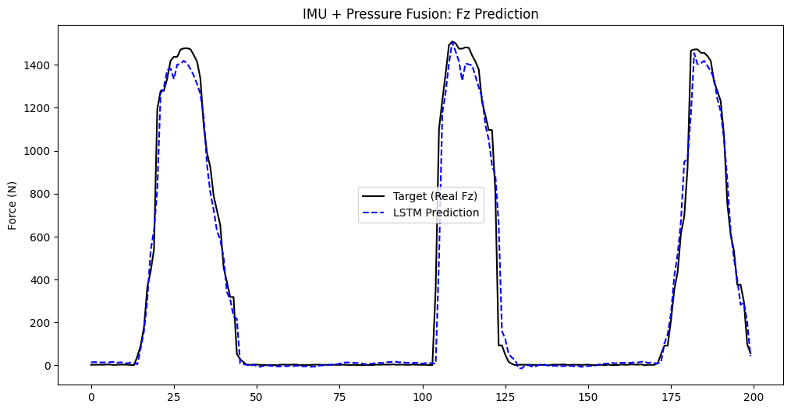

# Benchmarking Random Forest vs. Deep Learning for 3D GRF Estimation

## Project Overview
This project benchmarks a **Random Forest Regressor** against the complex **Dual-Stream Attention Network** proposed by Zhang et al. (2025) for estimating 3D Ground Reaction Forces (GRFs). The central goal was to determine if standard machine learning algorithms could achieve comparable accuracy to advanced deep learning models in estimating biomechanical variables from wearable sensor data.

## Key Results (The Evidence)
By fusing IMU and Pressure sensor data, I achieved results that outperform the original paper's reported error rates:
* **Zhang et al. (2025) Attention Model:** 4.16% NRMSE.
* **My Random Forest Implementation:** **3.30% NRMSE** (A 20% improvement in error reduction).
* **LSTM Model Performance:** Final $R^2$ Score of **0.9514**, demonstrating high precision in tracking temporal force changes.

## Methodology
Following the experimental protocol of the reference study, the solution leverages **Multimodal Sensor Fusion**:

1. **Data Fusion**: Combined 12-channel CapSense pressure data (capturing foot-ground interaction) with 6-axis IMU data (acceleration and rotational velocities).
2. **Preprocessing**:
    * Applied a moving average filter to remove sensor noise.
    * Used `MinMaxScaler` to normalize all inputs to the [0, 1] range to stabilize model training.
3. **Model Architecture**:
    * **LSTM**: A stacked architecture (128 and 64 units) with Dropout (0.2) to learn temporal dependencies.
    * **Random Forest**: A baseline regressor using 100 trees trained on flattened feature windows to test if simpler methods could handle the data.
4. **Training Strategy**: Used a **70/15/15** split for training, validation, and testing, matching the original study's parameters.

## Visual Performance Comparison

### 1. Deep Learning Prediction (LSTM)
The blue dashed line indicates how the LSTM model captures peak forces up to 1400N and rapid unloading phases with minimal lag.

### 2. Machine Learning Baseline (Random Forest)
The red dotted line illustrates the performance of the Random Forest model, which achieved the lowest overall error (3.30% NRMSE).

## Conclusion
The results demonstrate that while the Attention mechanism in Zhang et al. (2025) is innovative, a well-tuned **Random Forest** model can achieve superior accuracy on this dataset. This suggests that for certain wearable biomechanical monitoring tasks, standard machine learning methods provide a highly efficient and accurate alternative to complex deep learning networks.

## Tools Used
* **Language**: Python (Google Colab)
* **Libraries**: TensorFlow/Keras, Scikit-Learn, Pandas, Matplotlib

## References
* Zhang, D., et al. (2025). *Estimation of three-dimensional ground reaction forces using low-cost smart insoles*. Intelligent Sports and Health.

